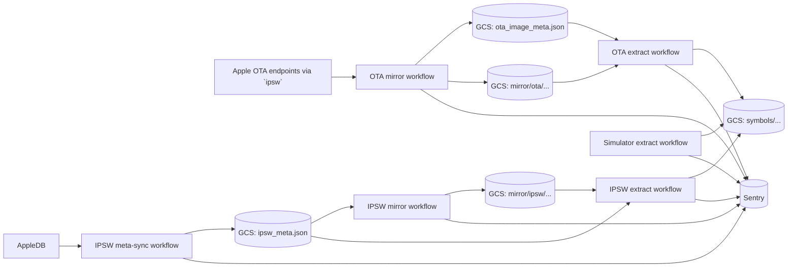

# Symx (aka Apfelpresse)

Symx collects Apple system symbols and uploads them into a GCS-backed symbol store.

In practice, Symx is **not** a long-running service. Today it consists of:

- scheduled and manually-triggered **GitHub Actions workflows**,
- a shared **Google Cloud Storage** bucket that holds metadata, mirrored artifacts, and uploaded symbols,
- **Sentry** for traces, logs, and metrics,
- a local **admin TUI/CLI** for inspecting failure states, downloading artifacts for reproduction, and queueing curated reruns.

## Documentation map

- [Architecture and state model](docs/architecture.md)
- [Operations, local setup, deployment, and debugging](docs/operations.md)

If you only read one thing after this README, read **[docs/architecture.md](docs/architecture.md)**.

## What Symx does

Symx has three processing lanes today:

1. **IPSW**
   - imports metadata from AppleDB,
   - mirrors selected IPSW files into GCS,
   - extracts symbols from mirrored IPSWs,
   - uploads the resulting symbol files.

2. **OTA**
   - fetches OTA metadata via the `ipsw` CLI,
   - mirrors OTA zip files into GCS,
   - extracts symbols from mirrored OTAs,
   - uploads the resulting symbol files.

3. **Simulator runtimes**
   - inspects the simulator dyld caches present on GitHub macOS runners,
   - extracts and uploads symbols from those caches.

A key nuance: **IPSW processing state is tracked per source file**, while **OTA processing state is tracked per artifact**. The shared enum lives in `symx/model.py`, but each pipeline uses only part of it. The detailed state tables and diagrams are in [docs/architecture.md](docs/architecture.md#artifact-state-model).

## High-level architecture



More detail, including the "who processes what when" walkthrough and the state diagrams, lives in [docs/architecture.md](docs/architecture.md).

## Production workflows at a glance

All schedules below are GitHub Actions cron schedules, so they are in **UTC**.

| Workflow                                                                                                                 | Schedule       | Runner              | Purpose                                       |
|--------------------------------------------------------------------------------------------------------------------------|----------------|---------------------|-----------------------------------------------|
| [`symx-ipsw-meta-sync.yml`](https://github.com/getsentry/symx/blob/main/.github/workflows/symx-ipsw-meta-sync.yml)       | `45 * * * *`   | Ubuntu              | Refresh `ipsw_meta.json` from AppleDB         |
| [`symx-ipsw-mirror.yml`](https://github.com/getsentry/symx/blob/main/.github/workflows/symx-ipsw-mirror.yml)             | `15 */6 * * *` | Ubuntu              | Mirror recent indexed IPSWs into GCS          |
| [`symx-ipsw-extract.yml`](https://github.com/getsentry/symx/blob/main/.github/workflows/symx-ipsw-extract.yml)           | `55 */6 * * *` | macOS               | Extract symbols from mirrored IPSWs           |
| [`symx-ota-mirror.yml`](https://github.com/getsentry/symx/blob/main/.github/workflows/symx-ota-mirror.yml)               | `30 */6 * * *` | Ubuntu              | Refresh OTA metadata and mirror indexed OTAs  |
| [`symx-ota-extract.yml`](https://github.com/getsentry/symx/blob/main/.github/workflows/symx-ota-extract.yml)             | `30 */6 * * *` | macOS               | Extract symbols from mirrored OTAs            |
| [`symx-simulator-extract.yml`](https://github.com/getsentry/symx/blob/main/.github/workflows/symx-simulator-extract.yml) | `0 4 * * *`    | GitHub macOS matrix | Upload simulator-cache symbols                |
| [`symx-admin-meta-sync.yml`](https://github.com/getsentry/symx/blob/main/.github/workflows/symx-admin-meta-sync.yml)     | on demand      | Ubuntu              | Build admin snapshot inputs for the local TUI |
| [`symx-admin-apply.yml`](https://github.com/getsentry/symx/blob/main/.github/workflows/symx-admin-apply.yml)             | on demand      | Ubuntu              | Apply curated admin rerun batches             |

The workflow files in [`.github/workflows/`](.github/workflows/) are the authoritative deployment config.

## Quick start

### 1. Install dependencies

Symx uses [`uv`](https://docs.astral.sh/uv/) for everything.

Helpful install/download links:

- [`uv`](https://docs.astral.sh/uv/)
- [`ipsw` latest GitHub release](https://github.com/blacktop/ipsw/releases/latest) / [`ipsw` Homebrew formula](https://formulae.brew.sh/formula/ipsw)
- [`gh` CLI](https://cli.github.com/)
- [Google Cloud CLI / `gcloud`](https://cloud.google.com/sdk/docs/install)
- [`symsorter` latest GitHub release](https://github.com/getsentry/symbolicator/releases/latest)

```bash
uv sync --dev
```

### 2. Optional local prerequisites depending on what you want to do

- **Admin / workflow inspection only**
  - [`gh` CLI](https://cli.github.com/) installed and authenticated
- **GCS-backed runs** (`ipsw meta-sync`, `ipsw mirror`, `ipsw extract`, `ota mirror`, `ota extract`, `sim extract`)
  - [Google Cloud CLI / `gcloud`](https://cloud.google.com/sdk/docs/install) credentials available via ADC / `GOOGLE_APPLICATION_CREDENTIALS`
  - a storage URI such as `gs://my-bucket` or `gs://my-project@my-bucket`
- **Extraction commands**
  - [`ipsw`](https://github.com/blacktop/ipsw/releases/latest) installed and on `PATH` (or via the [`ipsw` Homebrew formula](https://formulae.brew.sh/formula/ipsw))
  - executable `./symsorter` in the repo root (from the latest [`symbolicator` release](https://github.com/getsentry/symbolicator/releases/latest))
  - in practice, extraction is run on **macOS** in production

### 3. Common local commands

Inspect workflow health with the GitHub CLI:

```bash
gh workflow list
gh run list --workflow "Extract OTA symbols" --status failure --limit 20
gh run view <run-id> --log
```

Open the admin TUI:

```bash
uv run symx admin
```

Sync the admin cache without starting the TUI:

```bash
uv run symx admin sync
```

Reproduce extraction from a local file:

```bash
uv run symx ipsw extract-file /path/to/file.ipsw -p iOS -o /tmp/symx-ipsw
uv run symx ota extract-file /path/to/file.zip -p ios -V 18.2 -b 22C152 -o /tmp/symx-ota
```

Run a GCS-backed command against a bucket you control:

```bash
uv run symx ipsw meta-sync -s gs://my-project@my-bucket
uv run symx ipsw mirror -s gs://my-project@my-bucket -t 60
uv run symx ota mirror -s gs://my-project@my-bucket
```

> [!CAUTION]
> The GCS-backed commands mutate the configured storage directly. Use a non-production bucket unless you intentionally want to operate on production data.

## Monitoring and debugging quick hits

The shortest useful operator loop is usually:

1. inspect failing or slow runs in GitHub Actions,
2. look at the corresponding Sentry transaction,
3. sync a local admin snapshot with `symx admin sync` or open `symx admin`,
4. download the failing artifact from the admin TUI and reproduce with `extract-file` locally.

Useful entry points:

- GitHub Actions inspection: [docs/operations.md#github-actions](docs/operations.md#github-actions)
- Admin TUI and local SQLite snapshot: [docs/operations.md#admin-tui-and-local-snapshots](docs/operations.md#admin-tui-and-local-snapshots)
- Sentry tags, transactions, and metrics: [docs/operations.md#sentry](docs/operations.md#sentry)
- Failure-state diagrams: [docs/architecture.md#artifact-state-model](docs/architecture.md#artifact-state-model)

## Current system boundaries and caveats

A few things are important to know up front:

- **GCS is the shared source of truth** for current workflow state.
- **GitHub Actions is the scheduler/executor**, not just CI.
- **IPSW sync is conservative**: new artifacts are inserted, but significant changes to already-known IPSW artifacts are only logged today, not automatically merged.
- **OTA sync is more aggressive**: OTA metadata is merged into the stored set while preserving local processing progress.
- **The shared processing-state enum is reused across IPSW and OTA**, but some states are domain-specific and `ignored` is manual-only.
- **The current admin surface is intentionally narrow**: it syncs snapshots, inspects failures, downloads artifacts, and supports curated rerun batches. It is not a general-purpose state editor.

## Repository layout

- `symx/ipsw/` – IPSW metadata import, mirroring, extraction, storage backends
- `symx/ota/` – OTA metadata retrieval, mirroring, extraction, storage backends
- `symx/sim/` – simulator-runtime extraction
- `symx/admin/` – local admin cache, SQLite snapshot builder, TUI, download helpers
- `.github/workflows/` – production scheduling and deployment wiring
- `tests/` – unit tests

## Development and verification

Use `uv` for all local commands.

Before considering a change done, run the full check suite:

```bash
uv run ruff check --fix
uv run ruff format
uv run pyright
uv run pytest
```
