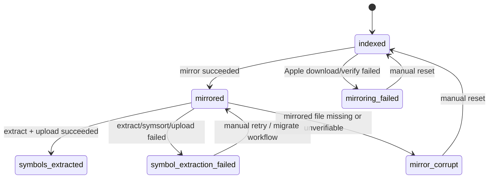
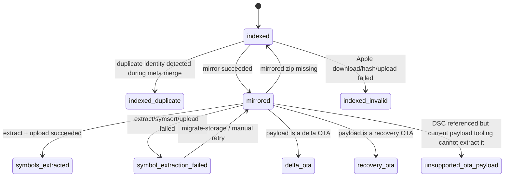

# Architecture and state model

This document explains how Symx works today: what gets processed, when state changes, where data lives, and which design choices shape the current system.

## 1. System model

### 1.1 The moving parts

Symx is built out of five main components:

1. **Apple-provided metadata and artifacts**
   - IPSW metadata comes from **AppleDB**.
   - OTA metadata comes from the `ipsw` CLI talking to Apple's OTA endpoints.
   - IPSW and OTA payloads are downloaded from Apple CDN URLs.

2. **GitHub Actions workflows**
   - schedule and run all production jobs,
   - authenticate to GCS via GitHub OIDC + Google Workload Identity,
   - bootstrap the runtime and invoke `symx` commands.

3. **Google Cloud Storage**
   - stores the current IPSW and OTA metadata JSON files,
   - stores mirrored IPSW/OTA payloads,
   - stores uploaded symbol files.

4. **Sentry**
   - receives traces, logs, and metrics from workflow runs,
   - is the main live observability surface for in-flight work.

5. **Local admin tooling**
   - dispatches GitHub Actions workflows to fetch remote metadata and apply curated rerun batches,
   - materializes a local SQLite snapshot,
   - powers the current failure-focused TUI for inspection, downloads, and curated reruns.

### 1.2 The three domains

| Domain    | Metadata source               | Processing unit                       | Main commands                                                     | Main outputs                                           |
|-----------|-------------------------------|---------------------------------------|-------------------------------------------------------------------|--------------------------------------------------------|
| IPSW      | AppleDB git repo              | `IpswSource` inside an `IpswArtifact` | `symx ipsw meta-sync`, `symx ipsw mirror`, `symx ipsw extract`    | `ipsw_meta.json`, `mirror/ipsw/...`, `symbols/...`     |
| OTA       | `ipsw download ota --json`    | `OtaArtifact`                         | `symx ota mirror`, `symx ota extract`                             | `ota_image_meta.json`, `mirror/ota/...`, `symbols/...` |
| Simulator | runner-local simulator caches | runtime / DSC files on the runner     | `symx sim extract`                                                | `symbols/...`                                          |

### 1.3 The most important modeling nuance

The word "artifact" does **not** mean the same thing everywhere:

- **IPSW** groups multiple source files under a single artifact key (`platform + version + build`).
  - Example: one IPSW artifact may contain multiple source URLs.
  - The workflow state lives on each **`IpswSource`**.
- **OTA** tracks state directly on each **`OtaArtifact`**.
- **Simulator** currently has no persisted meta-state machine in GCS.

That distinction matters when reading the state diagrams later: the IPSW diagram is really a **source-state** diagram, while the OTA diagram is an **artifact-state** diagram.

## 2. Who processes what when

## 2.1 IPSW lane

### Step 1: metadata sync

Workflow: [`symx-ipsw-meta-sync.yml`](../.github/workflows/symx-ipsw-meta-sync.yml)

1. GitHub Actions starts an Ubuntu job.
2. The job authenticates to GCP and runs `symx ipsw meta-sync -s $SYMX_STORE`.
3. `symx.ipsw.runners.import_meta_from_appledb()`:
   - downloads the current `ipsw_meta.json` from GCS,
   - clones or updates the AppleDB repo,
   - parses AppleDB JSON for supported platforms,
   - builds `IpswArtifact` / `IpswSource` objects,
   - inserts **new** artifacts into the stored meta DB.

Important current behavior:

- Existing IPSW artifacts are **not automatically rewritten** from AppleDB.
- Significant differences are detected and logged, but only brand-new artifacts are upserted.

That is a deliberate conservative choice: it avoids clobbering processing state or mirror pointers during sync, but it also means upstream metadata corrections are not automatically applied to already-known artifact keys.

### Step 2: mirroring

Workflow: [`symx-ipsw-mirror.yml`](../.github/workflows/symx-ipsw-mirror.yml)

1. GitHub Actions starts an Ubuntu job.
2. The job runs `symx ipsw mirror -t 315 -s $SYMX_STORE`.
3. `IpswGcsStorage.artifact_iter(mirror_filter)` continuously reloads the remote metadata and picks the next eligible artifact.
4. Eligibility is intentionally narrow:
   - release date must be in the current year or previous year,
   - at least one source must still be `indexed`.
5. For each eligible `IpswSource` still `indexed`:
   - download from Apple,
   - verify SHA-1 if present, otherwise size if present,
   - upload the file to `mirror/ipsw/<platform>/<version>/<build>/<file_name>`,
   - update the source state in `ipsw_meta.json`.

### Step 3: extraction

Workflow: [`symx-ipsw-extract.yml`](../.github/workflows/symx-ipsw-extract.yml)

1. GitHub Actions starts a macOS job.
2. The job runs `symx ipsw extract -t 315 -s $SYMX_STORE`.
3. `IpswGcsStorage.artifact_iter(extract_filter)` continuously reloads the remote metadata and picks the next artifact with at least one `mirrored` source.
4. For each mirrored source:
   - download the mirrored IPSW back from GCS,
   - verify it against the metadata,
   - run the IPSW extractor,
   - symsort the system image and the dyld shared cache content,
   - upload symbol files into `symbols/...`,
   - mark the source as `symbols_extracted` on success.

If extraction fails, the source is marked `symbol_extraction_failed`. If the mirrored object cannot be downloaded or verified, it becomes `mirror_corrupt`.

## 2.2 OTA lane

### Step 1: metadata refresh + mirroring

Workflow: [`symx-ota-mirror.yml`](../.github/workflows/symx-ota-mirror.yml)

OTA differs from IPSW because metadata refresh is part of the mirror workflow.

1. GitHub Actions starts an Ubuntu job.
2. The job runs `symx ota mirror -s $SYMX_STORE`.
3. `OtaMirror.update_meta()`:
   - calls the `ipsw` CLI to fetch current OTA metadata from Apple,
   - merges it into `ota_image_meta.json` in GCS.
4. The workflow iterates OTA artifacts still in `indexed`.
5. For each indexed OTA:
   - download the zip from Apple,
   - verify the SHA-1 recorded in metadata,
   - upload the zip to `mirror/ota/<platform>/<version>/<build>/<filename>`,
   - mark the artifact `mirrored`.

If an OTA download/hash/upload step fails, the current implementation marks the artifact `indexed_invalid`.

### Step 2: extraction

Workflow: [`symx-ota-extract.yml`](../.github/workflows/symx-ota-extract.yml)

1. GitHub Actions starts a macOS job.
2. The job runs `symx ota extract -t 330 -s $SYMX_STORE`.
3. `iter_mirror()` continuously reloads OTA metadata from GCS and always yields the newest mirrored OTA first.
4. For each mirrored OTA:
   - download the mirrored zip from GCS,
   - try the cryptex path first,
   - otherwise extract DSC content directly from the OTA,
   - split DSCs into binaries,
   - symsort them,
   - upload symbol files,
   - update the OTA state.

Special OTA-only exits:

- `delta_ota` – the payload is a delta/patch OTA and does not contain a full DSC.
- `recovery_ota` – the payload is a recovery OTA and does not contain a usable DSC.
- `unsupported_ota_payload` – the OTA appears to reference a full DSC, but the current payloadv2/Apple Archive tooling cannot materialize it.

If the mirrored OTA is missing when extraction starts, Symx resets it back to `indexed` and clears `download_path` so a later mirror run can fetch it again.

## 2.3 Simulator lane

Workflow: [`symx-simulator-extract.yml`](../.github/workflows/symx-simulator-extract.yml)

1. GitHub Actions starts a macOS matrix job (`macos-14`, `macos-15`, `macos-26`).
2. The job inspects simulator dyld caches already present on the runner image.
3. Symx splits and symsorts those caches and uploads symbol files.

Important caveats:

- This lane does **not** currently persist meta-state in GCS the way IPSW/OTA do.
- The current implementation returns after the first runtime it successfully uploads on a given runner image, so coverage comes from the runner matrix rather than exhausting every runtime on one machine.

## 2.4 Production schedule

All cron times are UTC.

| Workflow                     | Schedule       | Runner type         | Why that runner                                       |
|------------------------------|----------------|---------------------|-------------------------------------------------------|
| `symx-ipsw-meta-sync.yml`    | `45 * * * *`   | Ubuntu              | metadata sync only; no macOS-specific extraction work |
| `symx-ipsw-mirror.yml`       | `15 */6 * * *` | Ubuntu              | download + verify + upload only                       |
| `symx-ipsw-extract.yml`      | `55 */6 * * *` | macOS               | uses `ipsw mount`, `dyld split`, and `symsorter`      |
| `symx-ota-mirror.yml`        | `30 */6 * * *` | Ubuntu              | metadata fetch + mirroring only                       |
| `symx-ota-extract.yml`       | `30 */6 * * *` | macOS               | needs OTA extraction and DMG mounting paths           |
| `symx-simulator-extract.yml` | `0 4 * * *`    | GitHub macOS matrix | depends on runner-local simulator caches              |

Note that OTA mirror and OTA extract are both scheduled at the same minute. This works because the extractor reloads metadata on every loop iteration instead of taking a single stale snapshot at startup.

## 3. Where data lives

## 3.1 Remote data in GCS

Current important objects and prefixes:

- `ipsw_meta.json`
- `ota_image_meta.json`
- `mirror/ipsw/<platform>/<version>/<build>/<file_name>`
- `mirror/ota/<platform>/<version>/<build>/<file_name>`
- `symbols/...`

### Meta-data shape

- IPSW uses an `IpswArtifactDb` JSON object with a top-level `artifacts` map.
- OTA uses a JSON object mapping OTA keys directly to `OtaArtifact` payloads.

### Symbol uploads

`upload_symbol_binaries()` uploads the files produced by `symsorter` into `symbols/...`.

Important behaviors:

- file uploads use `if_generation_match=0`, so a symbol file upload is create-only and idempotent at the object level,
- duplicates are skipped rather than overwritten,
- rerunning an existing bundle is intentionally additive: existing symbol files stay untouched, missing files can still be uploaded, and Symx never overwrites symbols already present in the store.

## 3.2 Local admin cache

The admin surface builds a local cache under:

- `~/.cache/symx/admin/manifest.json`
- `~/.cache/symx/admin/snapshots/<snapshot_id>/snapshot.db`
- `~/.cache/symx/admin/snapshots/<snapshot_id>/ipsw_meta.json`
- `~/.cache/symx/admin/snapshots/<snapshot_id>/ota_image_meta.json`
- `~/.cache/symx/admin/downloads/`

The SQLite snapshot contains:

- `snapshot_info`
- `ipsw_artifacts`
- `ipsw_sources`
- `ota_artifacts`

This snapshot is for local inspection only. It is not an authoritative store.

## 4. Core decisions and trade-offs

## 4.1 GitHub Actions + GCS instead of a persistent service

**Chosen:** scheduled and dispatchable workflows writing into GCS.

**Not chosen:** a dedicated long-running ingestion service and database.

**Benefits**

- minimal moving parts,
- no extra service to deploy or operate,
- native fit for occasional batch-style work,
- easy to gate production access through workflow permissions.
- access to macOS runners

**Shortcomings**

- no continuous always-on control plane,
- state changes are batchy and eventually consistent,
- debugging often starts from workflow history rather than a live app.

## 4.2 Split workflows by stage

**Chosen:** separate meta-sync, mirror, and extract stages.

**Benefits**

- each stage can run on the cheapest/most suitable runner,
- failures isolate cleanly by stage,
- work can resume from persisted state instead of starting over.

**Shortcomings**

- more state transitions to reason about,
- more opportunities for "stuck between stages" failures,
- operators need to understand the shared meta-state to know what happens next.

## 4.3 Different runner classes for different stages

**Chosen:** Ubuntu for metadata sync and mirroring; macOS for extraction.

**Benefits**

- avoids paying macOS cost for tasks that do not need it,
- Ubuntu runners have higher availability and faster startup time,
- keeps extraction in the environment that has the right tooling and filesystem behavior.

**Shortcomings**

- production behavior is spread across two runtime environments

## 4.4 Reload remote metadata before each work item

Both IPSW and OTA use iterators that reload remote metadata on every loop iteration.

**Benefits**

- long-running jobs work against fresh state,
- concurrent workflows are less likely to keep acting on stale data,
- the system can pick up work that appeared after the workflow started.

**Shortcomings**

- repeated full meta JSON reads and parsing,
- no transactional multi-row view of the world,
- state reasoning is more dynamic than a single in-memory batch run.

## 4.5 Conservative IPSW sync vs state-preserving OTA merge

These could be aligned if we choose to use AppleDB as the metadata source for OTAs too.

### IPSW

**Chosen:** only insert new artifacts; log significant changes for existing ones.

**Benefit:** avoids accidentally regressing workflow state or mirror metadata.

**Shortcoming:** upstream corrections to hashes, sources, release dates, or other significant fields are not automatically applied to already-known artifact keys.

### OTA

**Chosen:** merge metadata while preserving local processing progress (`processing_state`, `download_path`).

**Benefit:** fresh OTA metadata can be ingested without losing progress.

**Shortcoming:** the merge logic becomes the authoritative definition of artifact identity and duplicate handling.

## 4.6 Shared state enum across domains

**Chosen:** one `ArtifactProcessingState` enum reused by IPSW and OTA.

**Benefits**

- one vocabulary for operator tooling,
- simpler admin filtering and display code.

**Shortcomings**

- not every state makes sense for every domain,
- some states are reserved or manual-only,
- IPSW and OTA use the shared enum slightly differently.

## 4.7 Duplicate suppression over duplicate processing

**Chosen:** avoid processing the same OTA payload twice when Apple exposes equivalent artifacts under multiple identities.

**Benefits**

- saves bandwidth and storage,
- avoids duplicate symbol uploads,
- keeps the operational surface focused on unique work,
- allows safe additive reruns of already-seen bundles when previous runs were partial or when new symbol locations are discovered.

**Shortcomings**

- duplicate detection rules become business logic that must stay correct.

## 5. Artifact state model

The shared enum lives in [`symx/model.py`](../symx/model.py).

Not all states are emitted by current automation. The table below reflects current code behavior.

| State                      | Meaning                                                                                 | Current automated emitters                   | Notes                                                                               |
|----------------------------|-----------------------------------------------------------------------------------------|----------------------------------------------|-------------------------------------------------------------------------------------|
| `indexed`                  | Known to Symx and eligible for processing                                               | IPSW sync, OTA merge, OTA extract reset path | Starting point for new work                                                         |
| `indexed_duplicate`        | Equivalent payload already represented elsewhere; skip duplicate processing             | OTA merge                                    | Current OTA-only duplicate suppression path                                         |
| `indexed_invalid`          | Metadata exists, but the artifact could not be mirrored reliably                        | OTA mirror                                   | Defined generically, but current IPSW mirror uses `mirroring_failed` instead        |
| `mirrored`                 | Artifact payload is present in GCS mirror storage                                       | IPSW mirror, OTA mirror                      | Input state for extraction                                                          |
| `mirroring_failed`         | Apple download or verification failed during IPSW mirroring                             | IPSW mirror                                  | Current IPSW failure state for mirror-stage problems                                |
| `mirror_corrupt`           | Metadata points at a mirror object that cannot be downloaded or verified                | IPSW extract                                 | Current IPSW-only emitted state                                                     |
| `delta_ota`                | OTA is a delta/patch update and has no full DSC                                         | OTA extract                                  | Expected terminal-ish skip state, not an error                                      |
| `recovery_ota`             | OTA is a recovery image and has no usable DSC                                           | OTA extract                                  | Expected terminal-ish skip state, not an error                                      |
| `unsupported_ota_payload`  | OTA appears to reference a full DSC, but current tooling cannot materialize the payload | OTA extract                                  | Terminal for current automation, but semantically distinct from delta/recovery OTAs |
| `symbols_extracted`        | Symbols were uploaded successfully                                                      | IPSW extract, OTA extract                    | Desired success state                                                               |
| `symbol_extraction_failed` | Extraction, splitting, symsort, or symbol upload failed                                 | IPSW extract, OTA extract                    | Current main recovery state                                                         |
| `ignored`                  | Manually excluded from processing                                                       | none                                         | Manual/operator-only concept; current automation does not assign it                 |

## 5.1 IPSW source state diagram

### IPSW state notes

- The persisted state lives on each **`IpswSource`**, not on the parent artifact.
- `mirror_filter()` only considers recent artifacts (current year or previous year).
- A source already in any non-`indexed` state is skipped by the mirror runner.
- A source must be `mirrored` to be eligible for extraction.
- The current `ipsw migrate` path is a narrow manual recovery mechanism: it resets a hard-coded list of failed sources from `symbol_extraction_failed` back to `mirrored`.

## 5.2 OTA artifact state diagram

### OTA state notes

- The persisted state lives directly on each **`OtaArtifact`**.
- OTA metadata merge preserves `processing_state` and `download_path` for already-known artifacts.
- `iter_mirror()` always reloads metadata and prefers the newest mirrored OTA first.
- `unsupported_ota_payload` is a terminal skip state distinct from `delta_ota` / `recovery_ota`: the OTA appears to reference a DSC, but current tooling cannot extract it.
- The current `ota migrate-storage` path resets **all** OTAs in `symbol_extraction_failed` back to `mirrored`.

## 5.3 Manual-only and domain-specific nuances

The shared enum is reused across IPSW and OTA, but the two pipelines do not emit the exact same subset.

Important current nuances:

- `ignored` is retained as a manual/operator-only state and is not assigned by current automation.
- `indexed_duplicate`, `delta_ota`, `recovery_ota`, and `unsupported_ota_payload` are OTA-specific states.
- `mirroring_failed` and `mirror_corrupt` are currently emitted only by the IPSW lane.

## 6. How concurrency is handled

There is no dedicated lock service.

Instead, Symx relies on a combination of:

- **workflow-level concurrency groups** in GitHub Actions,
- **state-based filtering** (`indexed`, `mirrored`, etc.),
- **live meta reloads** on each iteration,
- **GCS generation-match writes** for metadata updates.

For example, both `IpswGcsStorage.update_meta_item()` and `OtaGcsStorage.update_meta_item()` perform read-modify-write cycles guarded by `if_generation_match`. On conflict they retry.

This keeps the architecture simple, but it also means:

- updates operate against full JSON blobs,
- conflict handling is optimistic rather than lock-based,
- understanding the current state machine is essential for operators.

## 7. Current admin surface

The admin tooling in `symx/admin/` is intentionally narrower than a general-purpose state editor.

Current capabilities include:

- sync remote metadata into a local SQLite snapshot,
- inspect IPSW/OTA failure rows,
- resolve OTA `last_run` IDs into GitHub run metadata,
- download a selected artifact for local reproduction,
- build and apply curated rerun batches that queue eligible rows back to `indexed` or `mirrored`.
